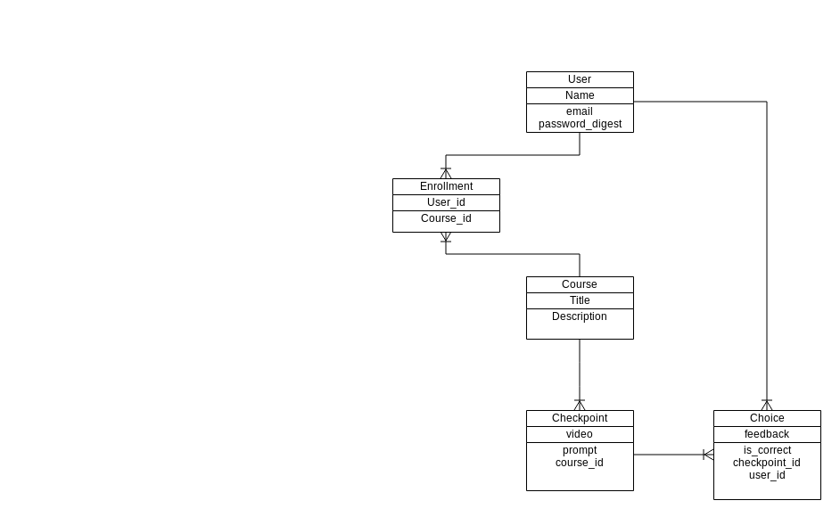

# Share The Baton

### GA WDI DC April 2014, Project 1

### Overview

**ShareTheBaton** is an educational web application designed to provide graduating nursing students with additional training that they might not get during a traditional degree program. It was developed as a sample Rails project for the April 2014 Web Development Immersive course at General Assembly. It was developed over a 4 day sprint to model the agile software development process.

### Technologies Used

* Ruby 2.1.1
* Ruby on Rails 4.1.1
* PostgreSQL Database
* Authentication & Authorization from scratch using [bcrypt-ruby](http://bcrypt-ruby.rubyforge.org/)
* Testing using using [rspec-rails](https://github.com/rspec/rspec-rails), [capybara](https://github.com/jnicklas/capybara), [shoulda-matchers](https://github.com/thoughtbot/shoulda-matchers) and [factory_girl_rails](https://github.com/thoughtbot/factory_girl_rails)
* CSS styling using [sass](https://sass-lang.com/) with SCSS syntax.

### User Stories Completed

* As a user I should land on a splash page for the site so that I have some idea of how to get started

### Backlog

A full list of user stories can be found by looking at [this Pivotal Tracker Project](https://www.pivotaltracker.com/projects/1086920)

### ERD

---
###### Written by Mikael Davis
